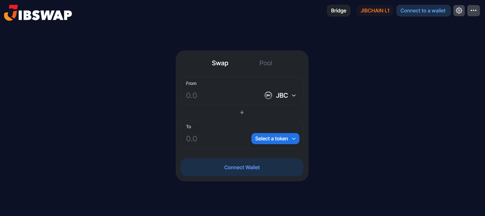

# 🏷 Welcome to JIBSWAP

<figure><figcaption>
Jibswap V1
</figcaption></figure>

**Jibswap** is a decentralized cryptocurrency trading protocol that operates on the JIB Chain. As an Automated Market Maker (AMM) and Decentralized Exchange (DEX), Jibswap offers users a platform for engaging in crypto trading and exchanges in a decentralized manner. The platform is built using a system similar to the Uniswap V2 fork, positioning it within the broader landscape of decentralized finance (DeFi).

## **Key features of Jibswap include:**

* **Decentralization**: Emphasizing user autonomy and reduced reliance on centralized authorities.
* **Crypto Trading**: Facilitating the exchange of various cryptocurrencies in a secure environment.
* **AMM System**: Utilizing an automated market-making system to provide liquidity and enable trading.
* **Community-Driven Development**: Regular updates and active development, with a focus on community involvement and open-source collaboration.

For comprehensive details about Jibswap, including specific services, user guides, and the latest updates, you can visit their official website at [Jibswap](https://jibswap.com/). The website provides a portal into the platform, offering insights into how it integrates within the DeFi ecosystem and serves its user base.
